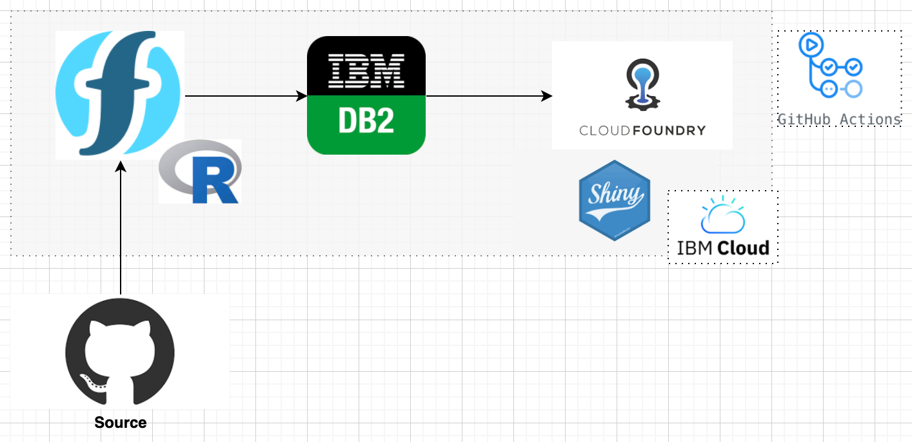

---
output:
  xaringan::moon_reader:
    seal: false
    lib_dir: libs
    css: ["default", "rladies-fonts", "resources/css/progress.css", "resources/css/adds.css"]
    nature:
      ratio: "16:9"
      highlightStyle: github
      highlightLines: true
      countIncrementalSlides: false
      slideNumberFormat: |
        <div class="progress-bar-container">
          <div class="progress-bar" style="width: calc(%current% / %total% * 100%);">
          </div>
        </div>
---

```{r setup, include=FALSE}

knitr::opts_chunk$set(message = FALSE, 
                      warning = FALSE, 
                      fig.retina = 3,
                      comment = NA)

options(htmltools.preserve.raw = FALSE)

```

class: inverse, left, middle

background-image: url(resources/images/cover.gif)
background-size: cover

# R + Analytics + Cloud

### Analytics/Big Data Training


.large[Thiago Pires | 22 and 23 Apr 2021 <br> [github.com/th1460/r-analytics](https://github.com/th1460/r-analytics)]

---
layout: true

background-image: url(resources/images/logo-ibm.png)
background-position: 97% 3%
background-size: 7%

---
class: left middle
background-color: #00b33c

# Analytics

> .large[*Fact-based decisions have become our competitive strength. Using or not using analytics is no longer an option*]

---
# Analytics

> *Analytics is a comprehensive and multidimensional field that uses mathematical techniques, statistics, predictive modeling and machine learning to find meaningful patterns and knowledge in data.*

.pull-left[
**Florence Nightingale** recording and analyzing mortality data in the 1850s. She presented data on wounded soldiers with death counts per month. He ended up realizing that the main **death rate was due to hospital infection and not battle injuries**, as many imagined.
]

.pull-right[
```{r out.width="30%", echo=FALSE}
knitr::include_graphics("resources/images/nightingale.jpeg")
```
]

---
# Analytics

.pull-left[
A concrete example of spatial analysis carried out in 1854 in the city of London, where the population was **suffering a serious cholera epidemic**, disease about which at the time the form of contamination was not known. In a situation where more than 500 deaths had already occurred, the **Dr. John Snow had an idea: put on the city map the location of the cholera patients and the water wells** (at that time, the main source of water for the city's inhabitants). The obtained map is shown in the figure below.

*Dr. Snow realized that most cases were concentrated around the "Broad Street" well*
]

.pull-right[
```{r out.width="60%", echo=FALSE}
knitr::include_graphics("resources/images/snowmap.jpeg")
```
]


---
# Analytics

Data analysis can reveal correlations and patterns. There is less need to rely on assumptions or intuition. And it can help answer questions like:

- What happened?
- How or why it happened?
- What is happening now?
- What will likely happen next?

---
class: left middle
background-color: #9fa1f5

# R

---
# Linguagem R

.pull-left[
Developed by **Ross Ihaka** and **Robert Gentleman** in the Statistics department at the University of Auckland, New Zealand in 1993.

### Exemplo

```{r}
1 + 2 + (3 * 4)
f <- function(x) {x^2}
x <- seq(-5, 5, 1); f(x)
paste("If x = 2, then f(2) =", f(2))
```
]

.pull-right[
```{r out.width="20%", echo=FALSE}
knitr::include_graphics("resources/images/R.png")
```

```{r fig.height=4}
plot(x, f(x))
```
]

---
# Base language $\times$ Tidyverse

.pull-left[
### Base language
```{r}
# sum elements in a vector
sum(c(10, 5, 8, 12, 2, 0))

# data.frame
df <- data.frame(x = 1:3, y = letters[1:3])
df$z <- df$x^2

# filter and select
df[df$y == "b", c("x", "z")]
```
]

.pull-right[
### Tidyverse
```{r}
require(dplyr)
# sum elements in a vector
c(10, 5, 8, 12, 2, 0) %>% sum

# tibble
df <- tibble(x = 1:3, y = letters[1:3], z = x^2)

# filter and select
df %>% filter(y == "b") %>% select(x, z)
```
]

---
# Packages

.pull-left[
```{r echo=FALSE, out.width="95%"}

```
]

.pull-right[
```{r echo=FALSE, out.width="22%", fig.align="default"}

knitr::include_graphics("resources/images/tidymodels.svg")


```

```{r echo=FALSE, out.width="22%"}

knitr::include_graphics("resources/images/rmarkdown.png")
knitr::include_graphics("resources/images/xaringan.png")

```

```{r echo=FALSE, out.width="40%"}


```
]

---
class: left middle
background-color: #fca103

# CRISP-DM

> .large[*Cross Industry Standard Process for Data Mining*]

---
# CRISP-DM

.pull-left[
>*Cross-industry standard process for data mining, known as CRISP-DM is an open standard process model that describes common approaches used by data mining experts. It is the most widely-used analytics model*
]

.pull-right[
```{r echo=FALSE}
DiagrammeR::grViz("resources/images/crisp-dm.dot")
```
]

---
# Business Understanding

```{bash echo=FALSE}
dot -Tpng resources/images/p1.dot -o resources/images/p1.png
```

.center[
```{r echo=FALSE, out.width="90%"}
knitr::include_graphics("resources/images/p1.png")
```
]

#### Case Titanic dataset challenge

This is a *part* (train data) from the dataset used in Kaggle Titanic challenge

.pull-left[
#### Business question:
>*What factors was associated with a person survive in the Titanic disaster?*
]

.pull-right[
#### Features:
- How to analyze the data? (e.g. R, Python, etc)
- How prepare the data? (e.g. Pandas, dplyr, etc)
- What were the passager types (e.g. Ages, Gender, Class, etc)
]

---
# Titanic disaster

.pull-left[
```{r, map, eval=FALSE}
require(leaflet)

events <- bind_rows(
  tibble(location = "Southampton (10-04-1912)", 
         lng = -1.4191, lat = 50.7894),
  tibble(location = "Cherbourg (10-04-1912)", 
         lng = -1.6109, lat = 49.6445),
  tibble(location = "Queenstown (11-04-1912)", 
         lng = -8.3211, lat = 51.8535),
  tibble(location = "Naufrágio (14-04-1912)", 
         lng = -49.9408, lat = 41.7258),
  tibble(location = "New York", 
         lng = -73.9655, lat = 40.6832))

leaflet() %>%  addTiles() %>%
  addCircleMarkers(data = events %>% slice(1:3, 5), 
                   label = ~location,
                   color = c(rep("blue", 3), "green")) %>% 
  addMarkers(data = events %>% slice(4), 
             icon = list(
               iconUrl = "resources/images/sinking-ship.jpeg", 
               iconSize = c(50, 50)), 
             label = ~location) %>% 
  addPolylines(data = events, ~lng, ~lat)
```
]

.pull-right[
```{r, map, fig.height=5, fig.width=7, eval=TRUE, echo=FALSE}
```
]

---
# Data Understanding

```{bash echo=FALSE}
dot -Tpng resources/images/p2.dot -o resources/images/p2.png
```

.center[
```{r echo=FALSE, out.width="90%"}
knitr::include_graphics("resources/images/p2.png")
```
]

### Titanic case

```{r}
# Read data from Github
dataset <- "https://gist.githubusercontent.com/michhar/2dfd2de0d4f8727f873422c5d959fff5/raw/fa71405126017e6a37bea592440b4bee94bf7b9e/titanic.csv"
```

---
# Data Understanding (Titanic case)

.left-column[
### Study the data dictionary and
### Inspect the dataset
]

.right-column[
```{r}
titanic <- readr::read_csv(dataset)
titanic %>% glimpse()
```
]

---
# Data Understanding (Titanic case)

.pull-left[

### Detect key associations

```{r, associations0, eval=FALSE}
require(ggplot2)
theme_set(
  theme_minimal() + 
    theme(text = element_text(size = 18))
)

titanic %>% 
  ggplot(aes(Sex, ..count.., 
             group = Survived, 
             fill = as.factor(Survived))) + 
  geom_bar()

```
]

.pull-right[
```{r, associations0, fig.height=5, eval=TRUE, echo=FALSE}
```
]

---
# Data Understanding (Titanic case)

.pull-left[

### Detect key associations

```{r, associations1, eval=FALSE}

titanic %>% 
  ggplot(aes(Sex, ..count../sum(..count..), #<<
             group = Survived, 
             fill = as.factor(Survived))) + 
  geom_bar(position="fill") #<<

```
]

.pull-right[
```{r, associations1, fig.height=5, eval=TRUE, echo=FALSE}
```
]

---
# Data Understanding (Titanic case)

.pull-left[

### Detect key associations

```{r, associations2, eval=FALSE}
titanic %>% 
  ggplot(aes(Sex, ..count../sum(..count..), 
             group = Survived, 
             fill = as.factor(Survived))) + 
  geom_bar(position="fill") +
  facet_grid(~Pclass)

```
]

.pull-right[
```{r, associations2, fig.height=5, fig.width=9, eval=TRUE, echo=FALSE}
```
]

---
# Data Understanding (Titanic case)

.pull-left[

### Detect key associations

```{r, associations3, eval=FALSE}
titanic %>% 
  ggplot(aes(as.factor(Survived), Age)) + 
  geom_boxplot()

```
]

.pull-right[
```{r, associations3, fig.height=5, fig.width=9, eval=TRUE, echo=FALSE}
```
]

---
# Data Understanding (Titanic case)

.pull-left[
### Identify missing data

```{r, missing, eval=FALSE}
na_count <- function(x) sum(is.na(x))

titanic %>% 
  summarise(across(everything(), 
                   list(na_count), 
                   .names = "{.col}")) %>% 
  tidyr::pivot_longer(everything(), 
                      values_to = "n_missing")
```
]
.pull-right[
```{r, missing, eval=TRUE, echo=FALSE, highlight.output=c(9,14)}
```
]

---
# Data Understanding (Titanic case)

### Analyse distribution

.pull-left[
```{r fig.height=4}
require(ggplot2)

titanic %>% 
  ggplot(aes(x = Fare)) +
  geom_histogram() +
  theme_minimal()

```
]

.pull-right[
```{r}
titanic %>% 
  summarise(
    min(Fare),
    max(Fare),
    mean(Fare),
    median(Fare),
    e1071::skewness(Fare)
  ) %>% 
  tidyr::pivot_longer(everything(),
                      names_to = "measure") %>% 
  mutate(value = value %>% round(2))
```
]

---
# Data Understanding (Titanic case)

### Symetric distribution

.pull-left[
```{r fig.height=4}
set.seed(123)

dataset <- tibble(x = rnorm(100, 30, 2))
dataset %>% 
  ggplot(aes(x)) +
  geom_histogram(aes(y = ..density..)) +
  geom_density(aes(x), color = "blue") +
  theme_minimal()

```
]

.pull-right[
```{r}
dataset %>% 
  summarise(
    min(x),
    max(x),
    mean(x),
    median(x),
    e1071::skewness(x)
  ) %>% 
  tidyr::pivot_longer(everything(),
                      names_to = "measure") %>% 
  mutate(value = value %>% round(2))

```

]

---
# Data Preparation

```{bash echo=FALSE}
dot -Tpng resources/images/p3.dot -o resources/images/p3.png
dot -Tpng resources/images/p32_14.dot -o resources/images/p32_14.png
```

.center[
```{r echo=FALSE, out.width="50%"}
knitr::include_graphics("resources/images/p3.png")
```
]

.center[
```{r echo=FALSE, out.width="100%"}
knitr::include_graphics("resources/images/p32_14.png")
```
]

---
# Data Preparation (Titanic case)

.left-column[
### Do we drop rows? Which?
### How treat empty values?
]

.right-column[
.pull-left[

```{r, missing, eval=TRUE, echo=FALSE, highlight.output=c(9,14)}
```

]

.pull-left[
```{r}
titanic$Name[4]
```

```{r, fig.height=3}
require(forcats)
require(ggplot2)
titanic %>% 
  mutate(
    Title = Name %>% 
      stringr::str_extract(
        "(?<=\\,\\s)(.*)(?=\\.)") %>% 
      fct_lump(n = 4)) %>% 
  ggplot(aes(Title, Age)) + geom_boxplot()
```

]
]

---
# Data Preparation (Titanic case)

### After fix empty ages

.pull-left[
```{r, associations4, eval=FALSE}

titanic %>% 
  mutate(
    Title = Name %>% 
      stringr::str_extract("(?<=\\,\\s)(.*)(?=\\.)") %>% 
      fct_lump(n = 4)) %>% 
  group_by(Title) %>% 
  mutate(Age2 = ifelse(is.na(Age), median(Age, na.rm = TRUE), Age)) %>% 
  ggplot(aes(as.factor(Survived), Age2)) +
  geom_boxplot()

```
]

.pull-right[
```{r, associations4, fig.height=5, fig.width=9, eval=TRUE, echo=FALSE}
```
]

---
# Data Preparation (Titanic case)

.pull-left[
### Fix types and labels

```{r}
require(magrittr)
titanic %<>% 
  mutate(Sex = as.factor(Sex),
         Pclass = factor(Pclass,
                         labels = c("1st", "2nd", "3rd")),
         Survived = factor(Survived, 
                           labels = c("No", "Yes")),
         Embarked = fct_recode(Embarked, 
                               "Cherbourg" = "C", 
                               "Queenstown" = "Q",
                               "Southampton" = "S"))
titanic %>% select(Sex, Survived, Embarked) %>% 
  print(n = 4)
```
]

.pull-right[
```{r}
freq <- function(data, x) {
  table <- data %>% 
    count({{x}}) %>% 
    mutate(`%` = (n/sum(n) * 100) %>% round(1)) %>% 
    rename(Levels = 1, N = 2)
  tibble(Variable = quo_name(quo({{x}}))) %>% 
    bind_cols(table)
}

c("Sex", "Survived", "Embarked", "Pclass") %>% 
  purrr::map_dfr(~ freq(titanic, !! sym(.x)))
```
]

---
# Modeling

```{bash echo=FALSE}
dot -Tpng resources/images/p4.dot -o resources/images/p4.png
```

.center[
```{r echo=FALSE, out.width="100%"}
knitr::include_graphics("resources/images/p4.png")
```
]

### Titanic case

>*What factors was associated with a person survive in the Titanic disaster?*

#### Model selection
- Logistic regression, Decision Tree, etc
- Features: Sex, Pclass, interaction between Sex and Pclass?
- Split strategy

---
# Modeling (Titanic case)

### Split data

```{r}
require(tidymodels)
set.seed(555)

# Put 3/4 of the data into the training set 
data_split <- initial_split(titanic, prop = 3/4)

# Create data frames for the two sets:
train_data <- training(data_split)
test_data  <- testing(data_split)
```

---
# Modeling (Titanic case)

.pull-left[

### `Survived ~ Sex + Pclass`

```{r}
lr_mod <- 
  logistic_reg() %>% 
  set_engine("glm")

lr_fit1 <- 
  lr_mod %>% 
  fit(Survived ~ Sex + Pclass, data = train_data)

lr_fit1 %>% tidy()
```
]

.pull-right[
```{r fig.height=3}
newdata <- 
  expand.grid(Pclass = c("1st", "2nd", "3rd"),
              Sex = c("male", "female"))
pihat <- 
  (lr_fit1 %>% predict(newdata, type = "prob")) %$% 
  .pred_Yes
newdata %>% mutate(Pihat = pihat) %>% 
  ggplot(aes(Sex, Pihat, 
             group = Pclass, colour = Pclass)) + 
  geom_line() + geom_point() +
  labs(x = "Sex", y = expression(pi(Survived == yes)), 
       colour = "Ticket Class") +
  theme_minimal()
```
]

---
# Modeling (Titanic case)

.pull-left[
### `Survived ~ Sex + Pclass + Sex:Pclass`

```{r}
lr_fit2 <- 
  lr_mod %>% 
  fit(Survived ~ Sex * Pclass, data = train_data)

lr_fit2 %>% tidy()
```
]

.pull-right[
```{r fig.height=3}
newdata <- 
  expand.grid(Pclass = c("1st", "2nd", "3rd"),
              Sex = c("male", "female"))
pihat <- 
  (lr_fit2 %>% predict(newdata, type = "prob")) %$% 
  .pred_Yes
newdata %>% mutate(Pihat = pihat) %>% 
  ggplot(aes(Sex, Pihat, 
             group = Pclass, colour = Pclass)) + 
  geom_line() + geom_point() +
  labs(x = "Sex", y = expression(pi(Survived == yes)), 
       colour = "Ticket Class") +
  theme_minimal()
```
]

---
# Evaluation

```{bash echo=FALSE}
dot -Tpng resources/images/p5.dot -o resources/images/p5.png
```

.center[
```{r echo=FALSE, out.width="100%"}
knitr::include_graphics("resources/images/p5.png")
```
]

### Mensures

.pull-left[
| Predicted\Actual |        Survived        |       No Survived      |
|:----------------:|:----------------------:|:----------------------:|
|     Survived     |  True Positive<br>(TP) | False Positive<br>(FP) |
|    No Survived   | False Negative<br>(FN) |  True Negative<br>(TN) |
]

.pull-right[
.tiny[
$$\text{Accuracy} = \frac{TP + TN}{TP + TN + FP + FN}$$

$$\text{Precision} = \frac{TP}{TP + FP}$$

$$\text{Recall} = \frac{TP}{TP + FN}$$
$$F_{1-score} = \frac{2\times\text{precision}\times\text{recall}}{\text{precision} + \text{recall}}$$
]]

---
# Evaluation (Titanic case)

```{r}
measure <- function(data) {
  data %>% accuracy(truth = Survived, .pred_class) %>% 
    bind_rows(data %>% f_meas(truth = Survived, .pred_class))
}
```


.pull-left[
### `Survived ~ Sex + Pclass`

```{r}
predict(lr_fit1, test_data) %>% 
  bind_cols(predict(lr_fit1, 
                    test_data, type = "prob")) %>% 
  bind_cols(test_data %>% select(Survived)) %>% 
  measure()
```
]

.pull-right[
### `Survived ~ Sex + Pclass + Sex:Pclass`

```{r}
predict(lr_fit2, test_data) %>% 
  bind_cols(predict(lr_fit2, 
                    test_data, type = "prob")) %>% 
  bind_cols(test_data %>% select(Survived)) %>% 
  measure()
```
]

---
# Deployment

```{bash echo=FALSE}
dot -Tpng resources/images/p6.dot -o resources/images/p6.png
```

.center[
```{r echo=FALSE, out.width="100%"}
knitr::include_graphics("resources/images/p6.png")
```
]

---
# Deployment (Titanic case)

### Save model

```{r eval=FALSE}
yaml::write_yaml(
  tidypredict::parse_model(lr_fit1), 
  "R/my_model.yml"
)
```

---
# Deployment (Titanic case)

### IBM Cloud Functions

> IBM Cloud™ Functions service is an event-driven compute platform, also referred to as Serverless computing, or as Function as a Service (FaaS), that runs code in response to events or direct invocations.

### Configure

#### `exec`

```
#!/bin/bash

# run R script
chmod +x script.R # turn executable
echo "$@" > input.json # set input
./script.R # run script
```

#### `Dockerfile`

```
FROM openwhisk/dockerskeleton
RUN apk update && apk add R R-dev R-doc build-base
RUN R -e "install.packages(c('jsonlite', 'tidypredict', 'yaml'), repos = 'http://cran.rstudio.com/')"
```

---
# Deployment (Titanic case)

### IBM Cloud Functions

### Configure

#### `script.R`

```
#!/usr/bin/env Rscript

# load model
loaded_model <- 
tidypredict::as_parsed_model(
yaml::read_yaml("my_model.yml"))

# input
input <- jsonlite::fromJSON("input.json", flatten = FALSE)

# compute prediction
pred <- tidypredict::tidypredict_to_column(as.data.frame(input), loaded_model)

# output
jsonlite::stream_out(pred, verbose = FALSE)
```

---
# Deployment (Titanic case)

### IBM Cloud Functions

### Deploy

```
# docker
docker build th1460/titanic .
docker push th1460/titanic

# login
ibmcloud login -sso
ibmcloud target --cf

# zip
zip -r titanic.zip exec script.R my_model.yml

# deploy
ibmcloud fn action create titanic titanic.zip --docker th1460/titanic --web true
```

---
# Deployment (Titanic case)

### IBM Cloud Functions

### Request

```{r}
input <- list(Sex = "male", Pclass = "3rd")

"https://us-south.functions.appdomain.cloud/api/v1/web/thiago.pires%40ibm.com_dev/default/titanic.json" %>% 
  httr::POST(., body = input, encode = "json") %>% 
  httr::content() %>% 
  .[c("Sex", "Pclass", "fit")] %>% 
  jsonlite::toJSON(pretty = TRUE, auto_unbox = TRUE)
```

---
# Deployment (Titanic case)

### IBM Cloud Functions

.center[
```{r echo=FALSE, out.width="70%"}

```
]

---
class: left middle
background-color: #ff7f7f

# Covid 19 Analysis

---
# Covid 19 Analysis

.center[
```{r echo=FALSE, out.width="80%"}

```
]

Repository: [github.com/th1460/covid19](https://github.com/th1460/covid19)

---
# Covid 19 Analysis

### IBM Functions

- `Dockerfile.update`
- `exec`
- `read_update_data.R`
- `.Renviron`

```
# Docker build
docker build -t th1460/update-covid -f Dockerfile.update .

# Docker push
docker push th1460/update-covid

# Package files
zip -r update_covid.zip exec read_update_data.R .Renviron

# Create function
ibmcloud fn action create update-covid19 update_covid.zip --docker th1460/update-covid --web true
```

---
# Covid 19 Analysis

### Cloud foundry

- `Dockerfile.app`
- `app.R`
- `manifest.yml`

```
# Docker build
docker build -t th1460/dash-covid -f Dockerfile.app .

# Docker push
docker push th1460/dash-covid

# Deploy shiny
ibmcloud cf push dash-covid --docker-image th1460/dash-covid -k 2G
```

---
# Covid 19 Analysis

### Dashboard

.center[
```{r echo=FALSE, out.width="70%"}

```
]

---
# References

- https://www.aws.training/Details/eLearning?id=27200
- https://the-modeling-agency.com/crisp-dm.pdf
- https://github.com/th1460/shiny-example
- https://github.com/th1460/r-actions-example

---
class: inverse center middle
background-color: #000

th1460.github.io<br>
github.com/th1460<br>
linkedin.com/in/thop<br>
slack: @thop
